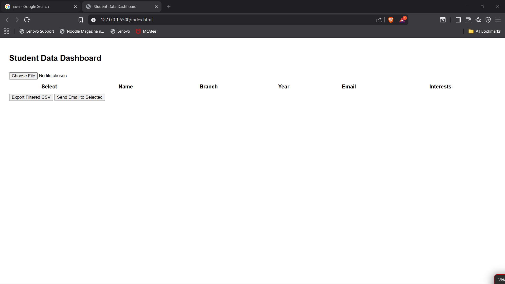
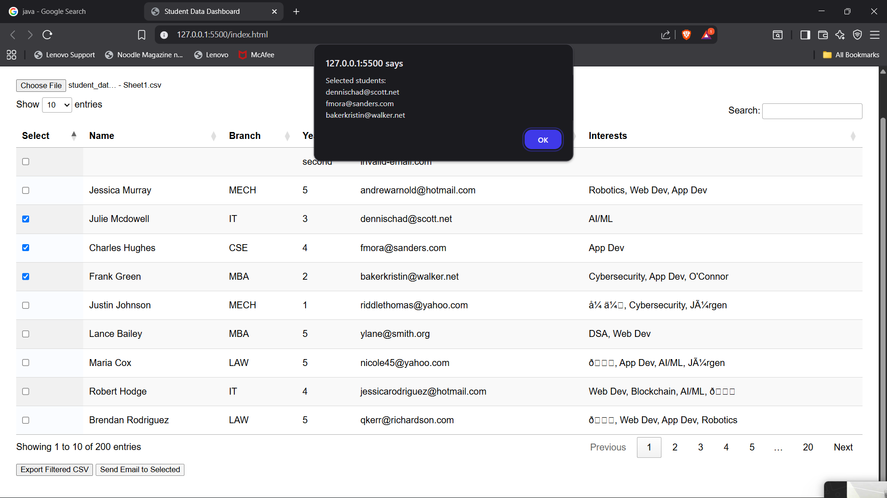

# 📚 Student Dashboard

A lightweight and interactive web application for managing student records.  
Upload Excel files, view and filter student data, and export results as CSV — all from your browser.

---

## 🚀 Overview
The *Student Dashboard* simplifies the process of handling student information.  
It allows you to upload data from an Excel file, display it in a searchable and sortable table, and export filtered records when needed.

---

## ✨ Features
- 📂 *Excel File Upload* – Import student records quickly.
- 🔍 *Search & Filter* – Find specific students instantly.
- 📊 *Sortable Table* – Organize data by any column.
- ✅ *Bulk Selection* – Select multiple records at once.
- 📤 *Export as CSV* – Download filtered data easily.
- 📱 *Responsive Design* – Works seamlessly on desktop and tablet.

---

## 🛠 Technologies Used
- *HTML5* – Structure
- *CSS3* – Styling
- *JavaScript (Vanilla JS)* – Functionality
- **[SheetJS](https://sheetjs.com/)** – Excel file reading
- **[DataTables](https://datatables.net/)** – Interactive table

---

## 📂 Project Structure
student-dashboard/
│
├── index.html       # Main HTML file
├── style.css        # CSS styling
├── script.js        # JavaScript logic
├── README.md        # Project documentation
└── sample.xlsx      # Example student data file

## DEMO

